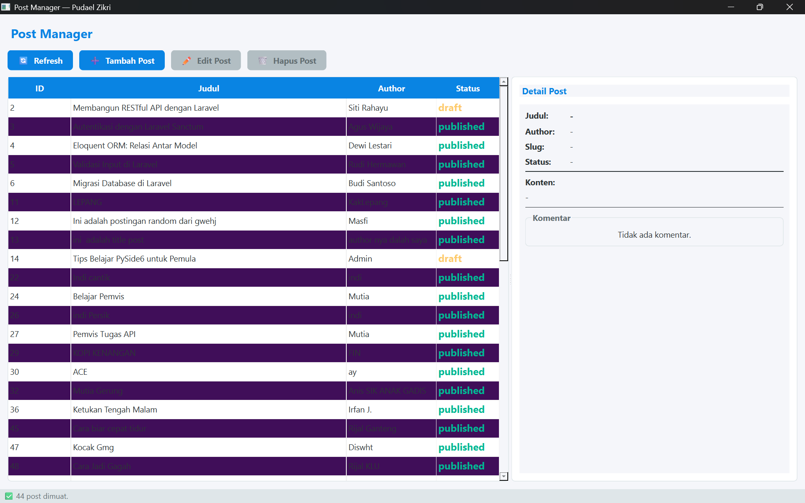
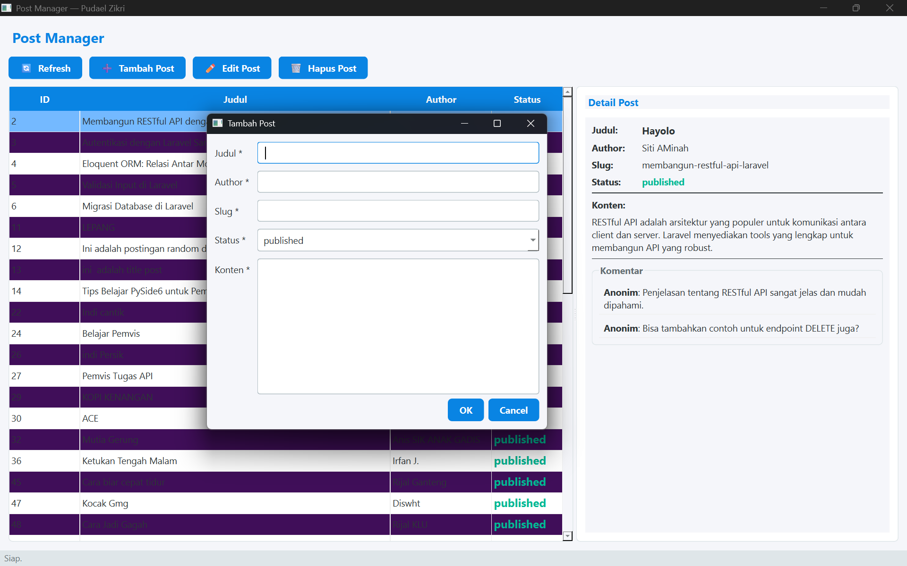
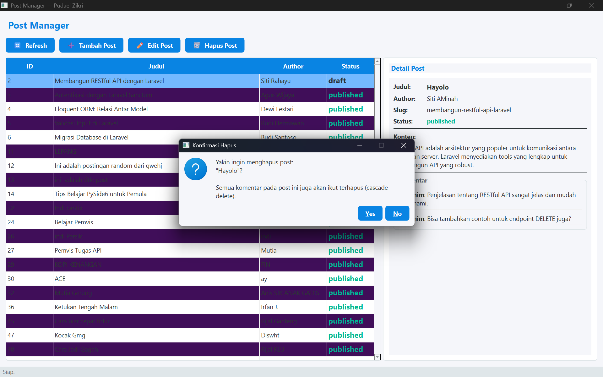

**Nama:** Pudael Zikri  
**NIM:** F1D02310088  
**Kelas:** C  

## Deskripsi Tugas
Program ini adalah aplikasi desktop berbasis **PySide6** untuk mengelola data postingan yang dihubungkan dengan layanan REST API (`https://api.pahrul.my.id/api/posts`).

Aplikasi ini memiliki fitur dan implementasi utama sebagai berikut:
1. **Operasi CRUD Lengkap**: 
   - **GET**: Menarik seluruh data *posts* dan menampilkannya di dalam tabel yang terstruktur. Terdapat juga panel detail untuk melihat isi konten dan komentar secara terpisah.
   - **POST**: Menambahkan postingan baru (title, body, author, slug, status) melalui form dialog.
   - **PUT**: Mengedit postingan yang ada dengan memodifikasi data melalui form dialog yang sama.
   - **DELETE**: Menghapus data *post* dengan adanya dialog konfirmasi, di mana proses ini juga akan menghapus komentar terkait di server.
2. **Implementasi Threading**: Seluruh operasi jaringan (request HTTP) dikelola menggunakan *thread* terpisah (di luar *Main Thread*). Hal ini membuat antarmuka (UI) tetap 100% responsif dan tidak *freeze* saat aplikasi sedang menunggu respons dari API.
3. **Tampilan dan Layout**: Antarmuka didesain menggunakan layout proporsional yang memisahkan bagian tabel dan detail (*master-detail view*) menggunakan `QSplitter`, sehingga memberikan kemudahan dalam membaca informasi detail setiap baris *post* dan *user*.
4. **Manajemen State & Penanganan Error**: 
   - Aplikasi memunculkan indikator status *"Memuat data..."* dan menonaktifkan komponen UI terkait ketika proses di latar belakang sedang berjalan untuk mencegah *double-request*.
   - Menampilkan peringatan berupa pesan dialog (*MessageBox*) dengan informasi yang jelas jika terjadi kendala, seperti kesalahan jaringan, *timeout*, atau kegagalan validasi *server-side* (misalnya masalah *slug*).

---

## Hasil Screenshot

### 1. Tampilan Utama (Tabel Post & Detail)

### 2. Tampilan Dialog Tambah / Edit Post

### 3. Tampilan Peringatan Error / Konfirmasi Hapus

